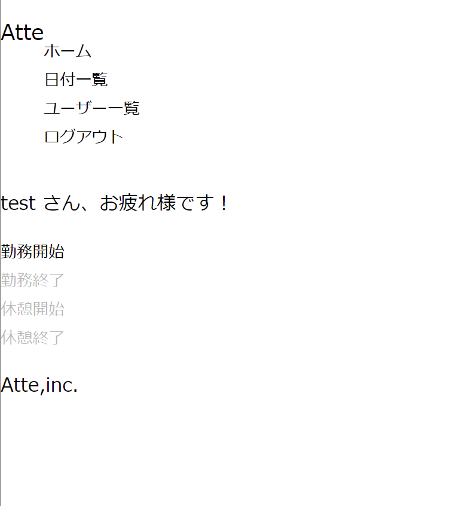
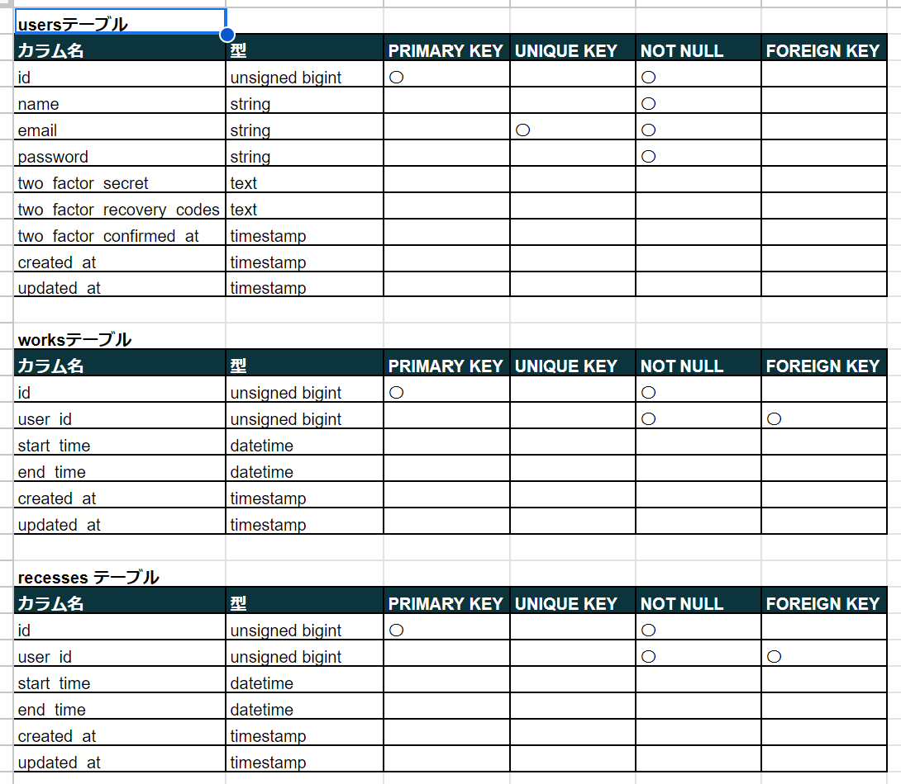
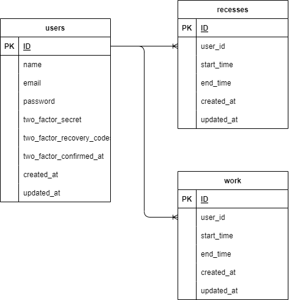

# SimuratedProject1st

# 勤怠管理アプリケーションAtte
### ユーザー認証機能をもつ勤怠管理システム 
### 勤怠開始、終了および休憩開始、休憩終了の記録が可能 
### また上記の情報を検索、表示も可能 

 

## 作成目的
### 社員の勤怠管理のため
 

## アプリケーションURL
### App :   localhost
### DB  :   localhost:8080
 

## 他のリポジトリ
## http://13.208.251.249
 

## 機能一覧
- ログイン・ログアウト機能
- 勤怠登録
- 休憩登録
- 登録日付一覧機能
- ユーザーごとの入力一覧機能
 

## 仕様技術(実行環境)
1. Docker
    - version 23.0.5, build bc4487a
2. Nginx
    - version: nginx/1.21.1
3. MySQL
    - Ver 8.0.26 for Linux on x86_64 (MySQL Community Server - GPL)
4. PHP
    - PHP 7.4.9 (cli)  
    (built: Sep  1 2020 02:33:08) ( NTS )
5. Laravel Framework
    - Laravel Framework 8.83.8

    
 

## テーブル設計

 

## ER図

 

## 環境構築
 

## その他
 